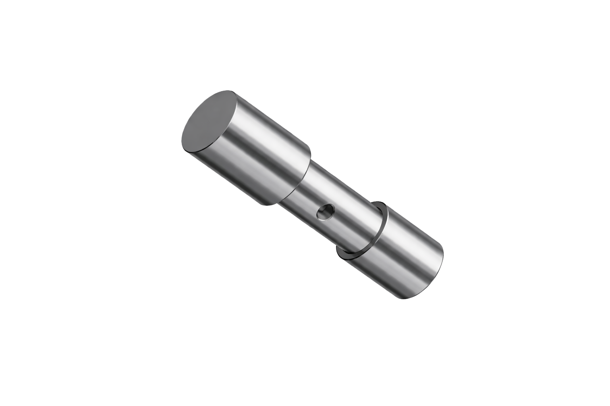

# Text2CAD  
**Contract‑Driven, Agentic CAD Generation with Deterministic Execution**

Text2CAD is an end‑to‑end, agent‑driven system that converts natural‑language engineering intent into **real, executable CAD artifacts** (STEP, FCStd).  
All geometry is generated and executed **headlessly** in FreeCAD and validated through strict contracts, deterministic execution, and closed‑loop evaluation.

This repository is not a prompt demo.  
It is an **engineering pipeline**.

---

## Why Text2CAD

Most text‑to‑CAD or text‑to‑3D approaches stop at:
- syntactically valid scripts
- visually plausible meshes
- best‑effort retries

Engineering workflows require more.

Text2CAD was built around one principle:

> **LLMs reason. Deterministic tools decide.**

The system treats CAD generation as a production process with explicit failure modes, measurable outcomes, and iterative convergence toward correctness.

---

## Core Capabilities

- **Real CAD output**  
  Headless FreeCAD execution producing STEP and FCStd artifacts

- **Contract‑driven generation**  
  Strict preflight rules reject invalid code *before* CAD execution

- **Agent separation of concerns**  
  Planning, implementation, validation, repair, execution, evaluation, learning

- **Deterministic execution layer**  
  CAD execution is ground truth — no hidden retries

- **Closed‑loop iteration**  
  Failures are classified and drive replanning

- **Measurable system behavior**  
  Every run produces KPI‑relevant traces and artifacts

---

## High‑Level Architecture

```
User Intent (Text)
   ↓
Planner Agent (Feature & Geometry Plan)
   ↓
Implementation Agent (FreeCAD Script)
   ↓
Preflight & Contract Gates
   ↓
Deterministic CAD Execution (FreeCAD, headless)
   ↓
Sensors (STEP, BBox, Volume, Renders)
   ↓
Evaluation & Failure Classification
   ↓
Learning & Replanning
   ↺
```

All agent communication occurs via explicit, versioned JSON artifacts.  
No component bypasses this flow.

---

## Agent Pipeline

Each agent has a **single responsibility** and no global authority.

**Planner (Architect)**  
- Translates text intent into a structured feature plan  
- Defines geometry strategy, references, order, acceptance criteria  
- Emits no executable code  

**Implementation Agent**  
- Converts the plan into FreeCAD `Part`‑based Python code  
- Operates under a restricted API subset  
- Produces exactly one executable artifact  

**Validation Agent**  
- Enforces strict runner contracts  
- Rejects forbidden APIs and patterns  

**Repair / Improver Agent**  
- Applies minimal, rule‑bound fixes  
- Never rewrites geometry wholesale  

**Execution Agent**  
- Runs FreeCAD headlessly  
- Produces real CAD artifacts  

**Evaluation Agent**  
- Verifies STEP validity, bounding box plausibility, rendering success  
- Emits PASS / FAIL with reasons  

**Learning Agent**  
- Aggregates failures and tightens constraints over time  
- Learns at the process level (no model fine‑tuning)

---

## Contracts & Preflight Gates

Before any CAD execution, scripts must pass:

1. **Runner Contract Validation**
   - Exact import block
   - Mandatory document creation
   - Single solid output
   - Exact STEP export
   - Forbidden APIs rejected

2. **Python Syntax Validation**

3. **Undefined‑Name Static Analysis (AST‑based)**

4. **Deterministic Auto‑Repair**
   - Normalizes boilerplate without changing geometry

Early failure is intentional.  
Wasted CAD executions are treated as architectural bugs.

---

## Outputs

Each run produces a fully inspectable artifact bundle:

- `job.py`, `runner.py`
- `result.step`, `result.FCStd`
- Rendered views (iso / front / right / top)
- Structured JSON payloads
- Execution logs and trace events

All artifacts are written to versioned run folders under `cad_runs_v01/`.

---

## Sample Results

A curated set of real prompts, renders, and STEP files is included:

- Prompt collection (German):  
  `Sample_Prompts_Images_Steps/jobs_worked_de.json`

- Rendered images:  
  `Sample_Prompts_Images_Steps/images/`

- STEP outputs:  
  `Sample_Prompts_Images_Steps/steps/`

Example outputs:




---

## Real Engineering Prompt Examples

Text2CAD is optimized for manufacturable, parametric parts:

- Stepped shafts with cross‑bores  
- Flanges with bolt circles  
- Hollow profiles with connected internal volumes  
- Manifolds with intersecting drillings  
- Plates with counterbores and pockets  

This is not a mesh‑generation demo.

---

## Measured System Performance

Based on 10 reference prompts:

- **Productivity:** ~4.5 CAD artifacts per iteration  
- **Stability:** ~0.6 failure events per CAD result  
- **First‑pass success:** ~20 %  
- **Learning effect:**  
  decreasing failure rate with increasing CAD yield  


---

## Quickstart

### 1. Environment

Create and activate a Python environment.

### 2. Install dependencies

```bash
pip install -r requirements.txt
```

### 3. Configure environment variables

Copy and adapt the example below into `enviromental.env`
(this file is intentionally **not committed**):

```env
AZURE_AI_PROJECT_ENDPOINT=https://<your-project>.services.ai.azure.com/api/projects/<project>
AZURE_AI_MODEL_DEPLOYMENT_NAME=<deployment>

FREECAD_CMD=/Applications/FreeCAD.app/Contents/Resources/bin/freecadcmd
CAD_WORKDIR=./cad_runs

# x86_64 Python with pythonocc-core (for rendering)
OCC_PY=/path/to/conda/envs/occx86/bin/python
```

### 4. Run

```bash
python main.py
```

Text2CAD also supports **batch execution** of multiple prompts in a single run.
In batch mode, the system iterates over a predefined job list and executes each prompt through the full agent loop.

```bash
python main.py -batchjob prompt.json
```

---

## Relation to Prior Work

Text2CAD is inspired by recent LLM‑based code‑generation systems (e.g. Blender‑based approaches),
but differs fundamentally:

| Aspect | Typical Text‑to‑3D | Text2CAD |
|------|-------------------|---------|
| Target | Visual meshes | Engineering CAD |
| Execution | Interactive / best‑effort | Deterministic / headless |
| Correctness | Plausibility | Verifiable geometry |
| Failure handling | Implicit | Explicit & classified |
| Learning | Prompt‑centric | Process‑centric |

Text2CAD is intentionally conservative and engineering‑first.

---

## Generalization

While instantiated for CAD, this architecture generalizes to:

- CAM & toolpath generation  
- Simulation setup & validation  
- Structured compliance artifacts  
- Any domain with deterministic execution and verifiable outputs

---

## Status

This repository is a **research‑grade, engineering‑focused prototype**.

It prioritizes correctness, transparency, and reproducibility  
over generative novelty or convenience.

---

## License

See `LICENSE`.

