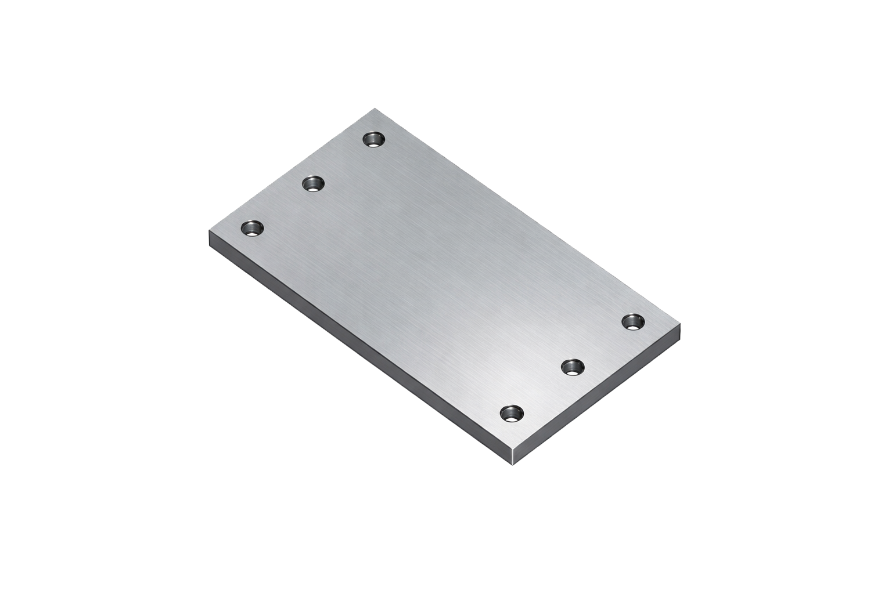
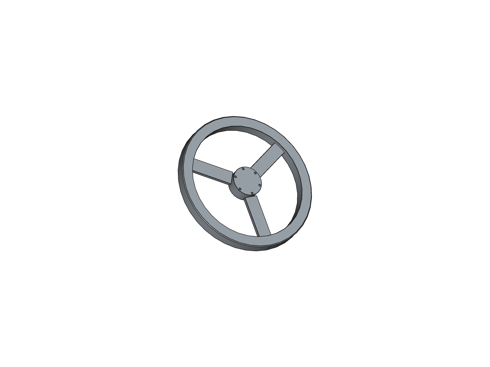
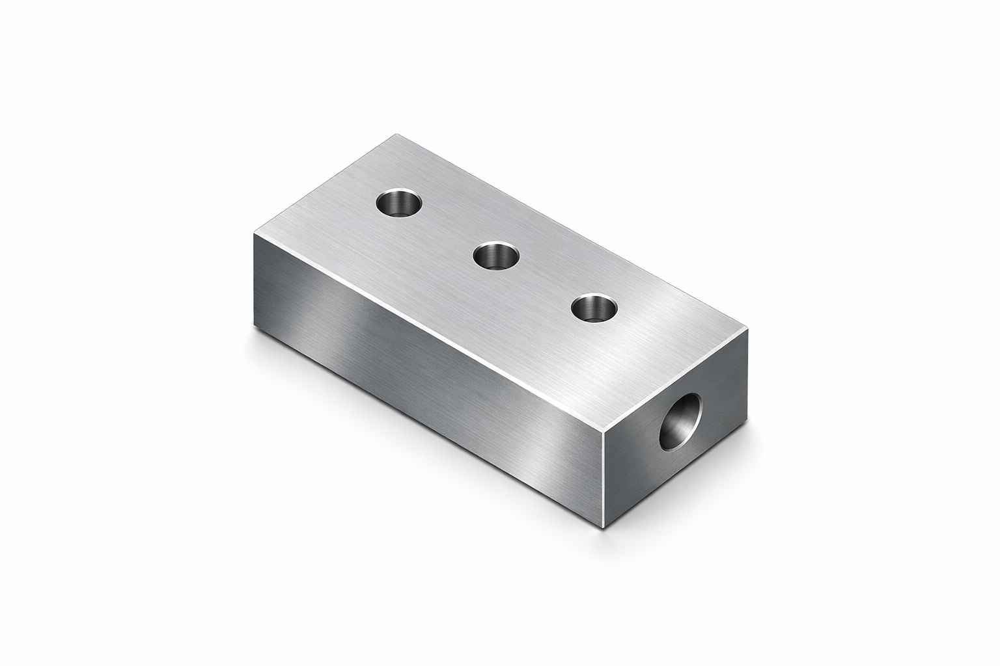
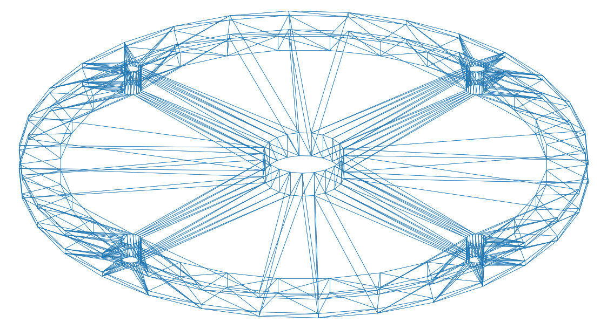
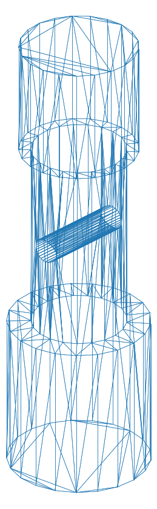
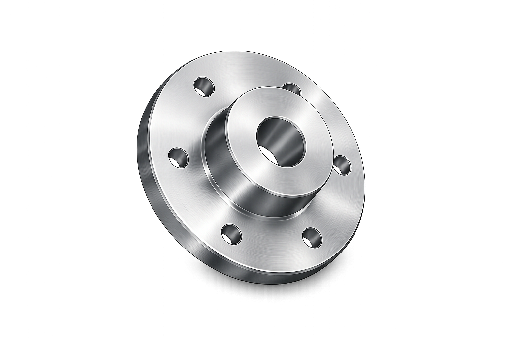

# Samples: Prompts, Renders, STEP

This folder contains curated prompts (German), rendered preview images, and STEP files. It is a quick way to evaluate the system on common mechanical primitives and variants.

## Prompt Summary (English)

Source: `jobs_worked_de.json`

- Base plate with corner holes and counterbores
- Ring flange with bolt circle
- Cube with through-hole and counterbore
- Block with pocket and through-holes
- Tube with cross-hole
- Hex bar blank with center bore
- L-block with intersecting horizontal and vertical bores
- Hub with counterbore and bolt pattern
- U-bracket with ears and through-holes
- T-pipe with connected internal volume
- Spacer with optional chamfers
- Rectangular block with counterbored hole pattern
- Stepped shaft with cross-hole
- Base plate with capsule slot and side holes
- Hollow box with top opening
- Flanged hub with bolt circle
- Split collar with radial slit
- U-profile cutout with side holes
- Coupling hub with internal keyway cut
- Manifold block with longitudinal and transverse bores
- Cover plate with gasket groove and screw holes
- Pulley with bore and bolt circle

## Image Gallery

Rendered views (example outputs):

## STEP Files

STEP outputs are in `steps/`:

- `steps/Handwheel.step`
- `steps/U_profil.step`
- `steps/baseplate.step`
- `steps/box.step`
- `steps/clamp_ring.step`
- `steps/flange.step`
- `steps/manifold.step`
- `steps/pulley.step`
- `steps/shaft.step`
- `steps/topplate.step`

## Notes

- Prompts are currently in German; see `jobs_worked_de.json` for full text.
- Images are edge renders from pythonocc for consistent comparison across runs.
